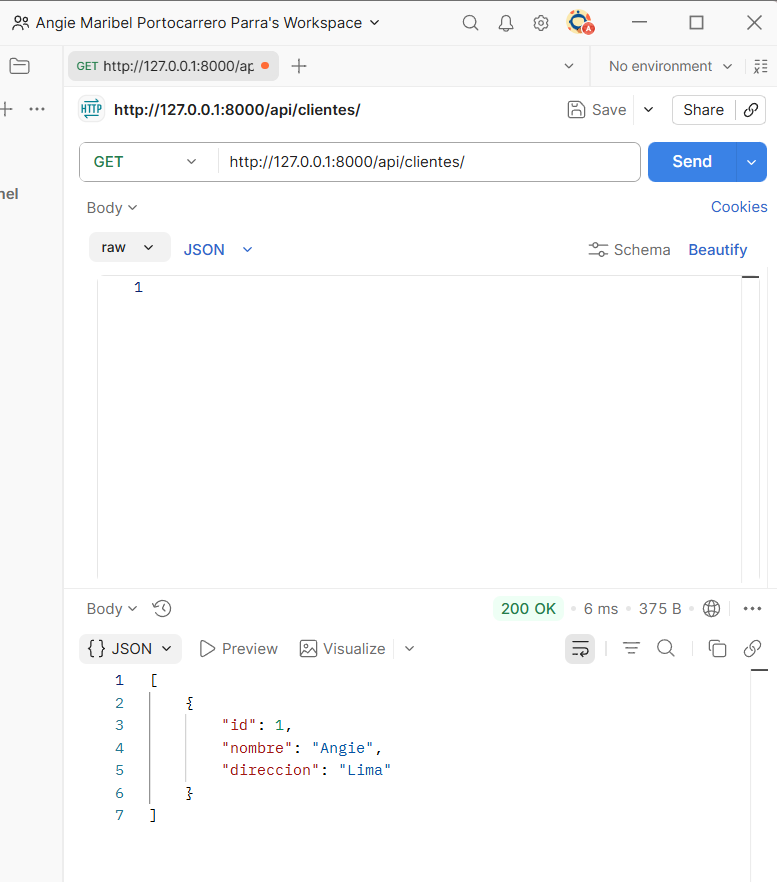
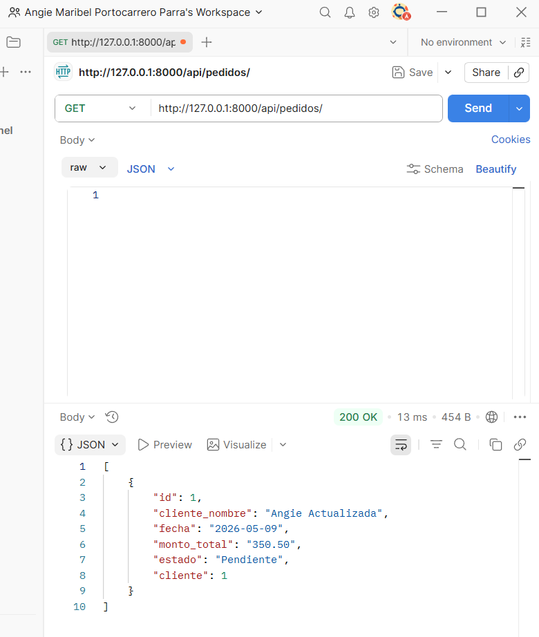
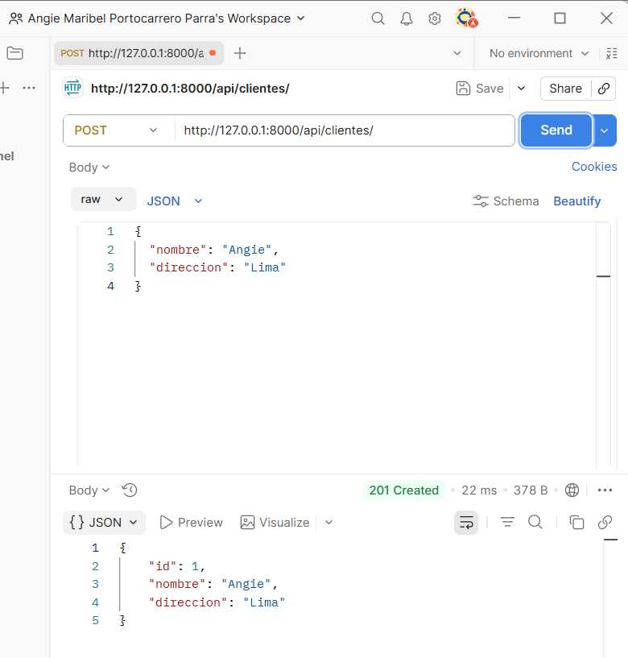
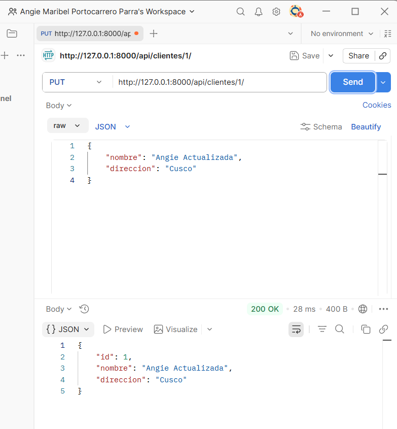
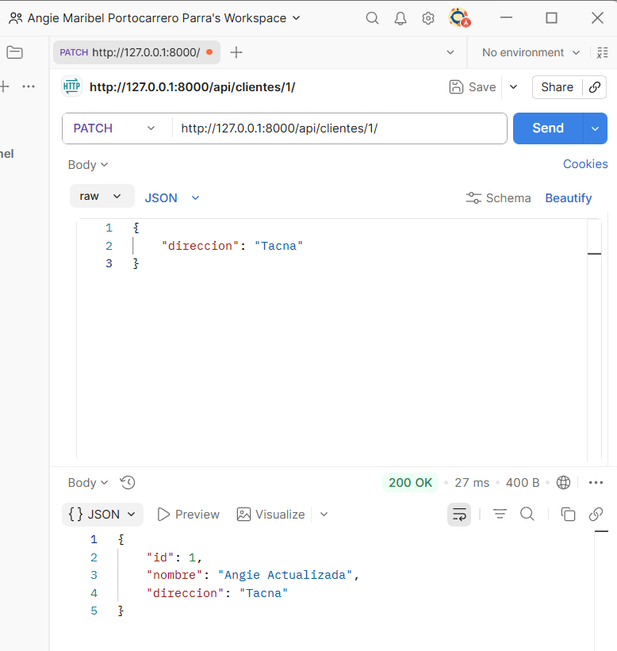
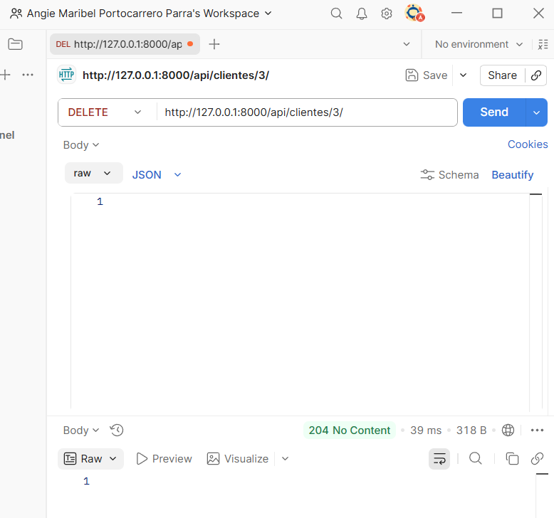
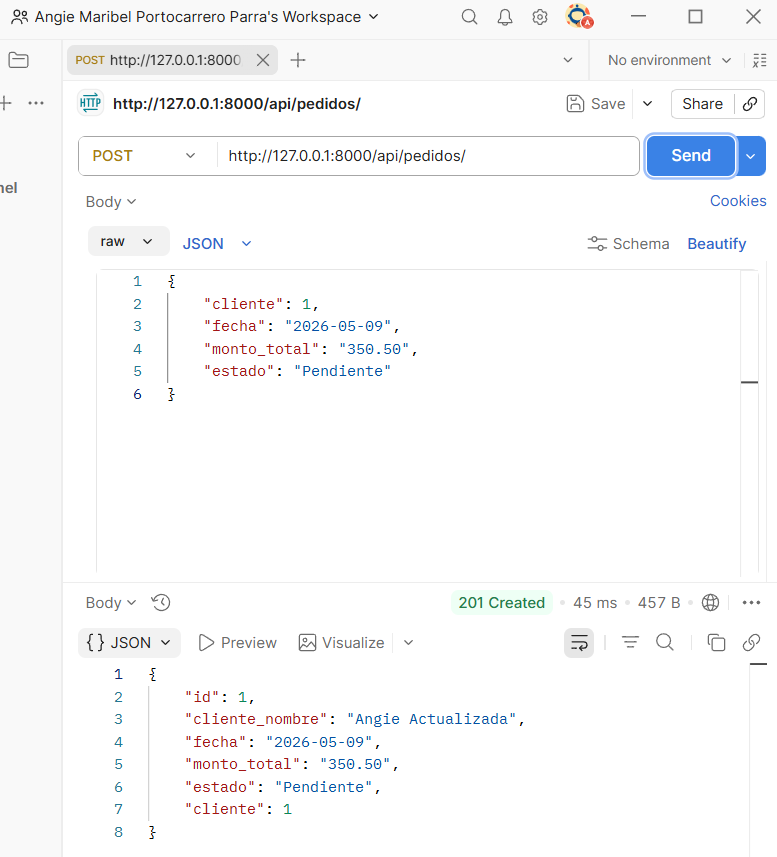
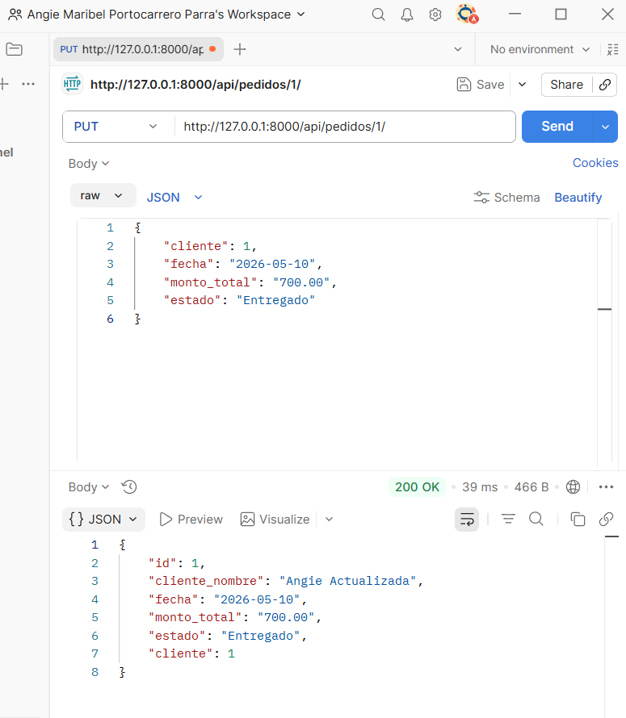
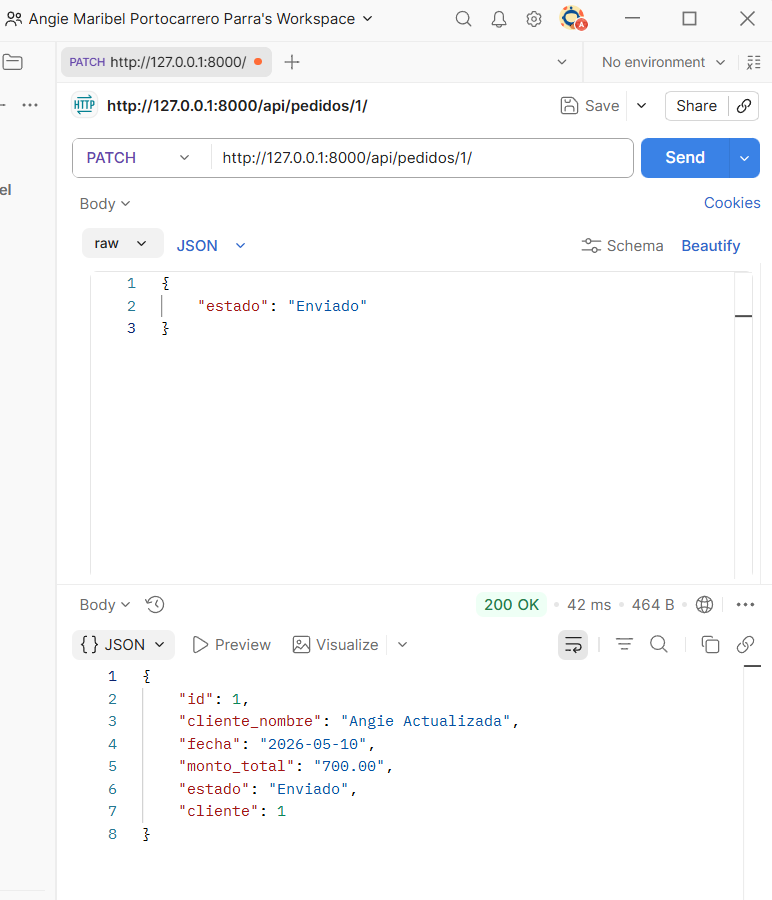
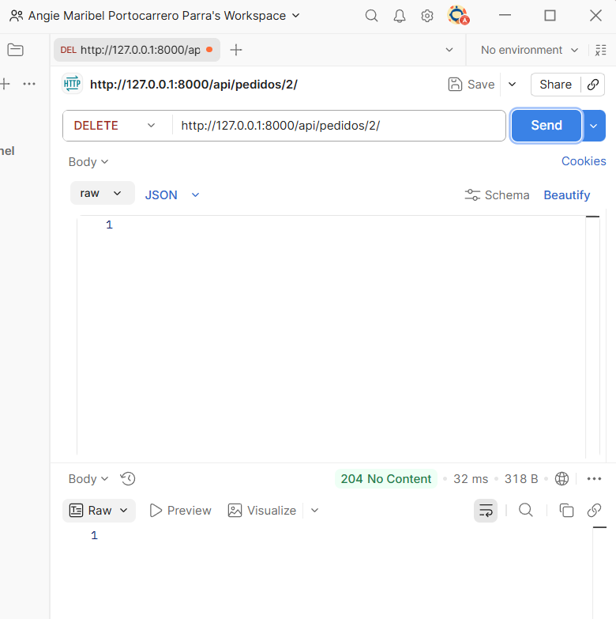

# ⋆｡˚ 📦 ˚ OrderFlow API ⋆｡𖦹 ˚｡⋆

---

## ┊ ✩  ┊   ✧   ┊   ┊

## ┊    ┊★      ┊   ✩⋆

## ┊    ┊       ⊹˚

---

# 🧾 Descripción del Proyecto

OrderFlow API es una API REST desarrollada con Django REST Framework que permite gestionar clientes y pedidos de manera eficiente.

La aplicación permite realizar operaciones CRUD completas para ambas entidades, además de implementar búsquedas y relaciones entre clientes y pedidos mediante endpoints REST.

---

# ⚙️ Tecnologías Utilizadas

- Python
- Django
- Django REST Framework (DRF)
- SQLite
- Postman
- Git & GitHub

---

# 🚀 Pasos para ejecutar el proyecto

1. Clonar el repositorio
2. Crear entorno virtual
3. Activar entorno virtual
4. Instalar dependencias
5. Ejecutar migraciones
6. Iniciar servidor

## 📌 Comandos utilizados

```bash
git clone https://github.com/anngiepp/orderflow_api.git

cd orderflow_api

python -m venv venv

venv\Scripts\activate

pip install -r requirements.txt

python manage.py migrate

python manage.py runserver
```

---

# 🌐 Endpoints Disponibles

## 👤 Clientes

| Método | Endpoint | Descripción |
|--------|----------|-------------|
| GET | `/api/clientes/` | Listar clientes |
| POST | `/api/clientes/` | Crear cliente |
| PUT | `/api/clientes/{id}/` | Actualizar cliente |
| PATCH | `/api/clientes/{id}/` | Editar parcialmente |
| DELETE | `/api/clientes/{id}/` | Eliminar cliente |

---

## 📦 Pedidos

| Método | Endpoint | Descripción |
|--------|----------|-------------|
| GET | `/api/pedidos/` | Listar pedidos |
| POST | `/api/pedidos/` | Crear pedido |
| PUT | `/api/pedidos/{id}/` | Actualizar pedido |
| PATCH | `/api/pedidos/{id}/` | Editar parcialmente |
| DELETE | `/api/pedidos/{id}/` | Eliminar pedido |
| GET | `/api/pedidos/?search=` | Buscar pedidos |

---

# 📬 Ejemplos de Uso

## ➕ Crear Cliente

```json
{
    "nombre": "Angie",
    "direccion": "Lima"
}
```

---

## ➕ Crear Pedido

```json
{
    "cliente": 1,
    "fecha": "2026-05-09",
    "monto_total": "350.50",
    "estado": "Pendiente"
}
```

---

## 🔍 Buscar Pedido por Estado

```bash
GET /api/pedidos/?search=Pendiente
```

---

## 🔍 Buscar Pedido por Nombre del Cliente

```bash
GET /api/pedidos/?search=Angie
```

---

# ૮ ˶ᵔ ᵕ ᵔ˶ ა EVIDENCIAS DEL FUNCIONAMIENTO

---

## 📸 API Root


---

## 📸 Endpoint Clientes



---

## 📸 Endpoint Pedidos



---

# ˶ˊᜊˋ˶ CRUD CLIENTES

---

## 📸 Create Cliente



---

## 📸 Read Cliente


---

## 📸 Update Cliente



---

## 📸 Patch Cliente



---

## 📸 Delete Cliente



---

# 📦 CRUD PEDIDOS

---

## 📸 Create Pedido



---

## 📸 Read Pedido


---

## 📸 Update Pedido



---

## 📸 Patch Pedido



---

## 📸 Delete Pedido



---

# 🔎 Búsquedas Implementadas

---

## 📸 Buscar por Estado


---

## 📸 Buscar por Nombre del Cliente


---

# ✨ Relación entre Pedido y Cliente

La API implementa correctamente la relación entre pedidos y clientes utilizando ForeignKey en Django.

Además, se personalizó la respuesta JSON para mostrar el nombre del cliente dentro del pedido, obteniendo así una respuesta más clara y amigable.

---

# ✩⋆ ✮ Conclusión

Se logró implementar correctamente una API REST funcional utilizando Django REST Framework, aplicando operaciones CRUD completas, búsqueda personalizada y relaciones entre entidades mediante endpoints REST.

El proyecto fue desarrollado siguiendo buenas prácticas básicas de organización, serialización y manejo de rutas, permitiendo una estructura limpia, escalable y fácil de mantener.